# Build Guide
## Checking the package contents
When you open the box, first make sure all the contents are included.

__Keyboard case body__.

The top and bottom bodies are screwed together with spare screws beforehand.
Please remove the screws and check the inside.

The inside of the case and other parts that are not visible from the front when assembled may have some scratches or may not be painted sufficiently.
In most cases, this is difficult to prevent due to the manufacturing process, so we appreciate your understanding.

Also, there may be a separate clearance problem with the E-White case, so please refer to [the following](#the-clearance-between-the-e-white-case-and-each-part).

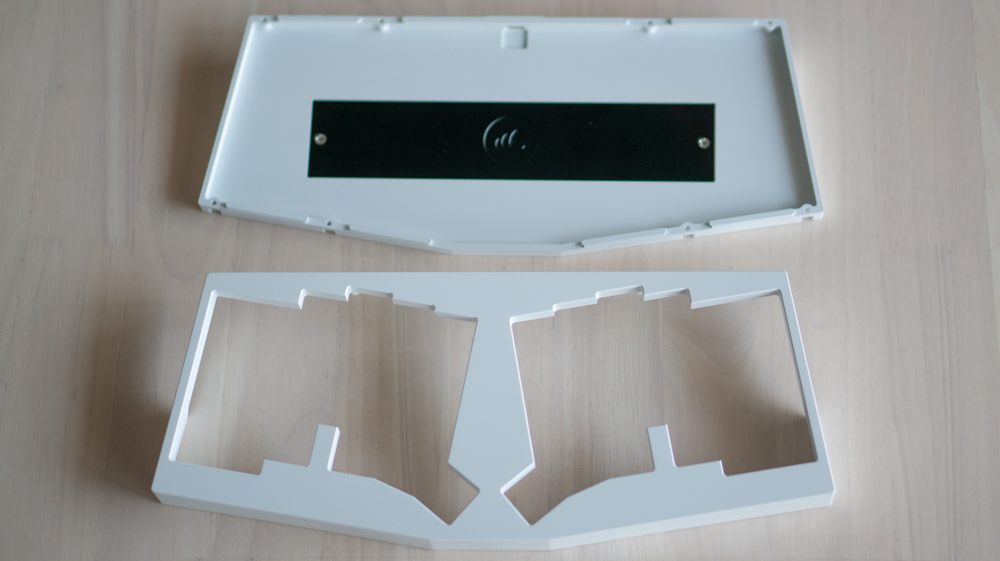

__PCB__

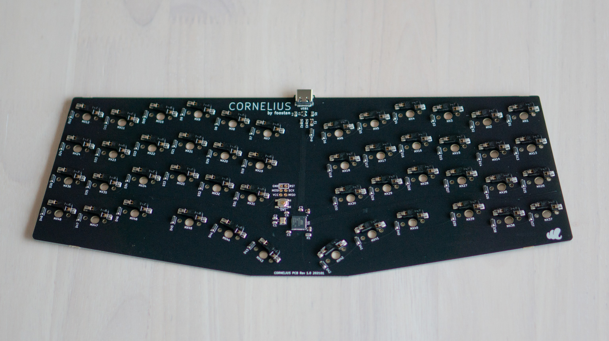

__Switch plate__

Please make sure the one you have chosen is included.

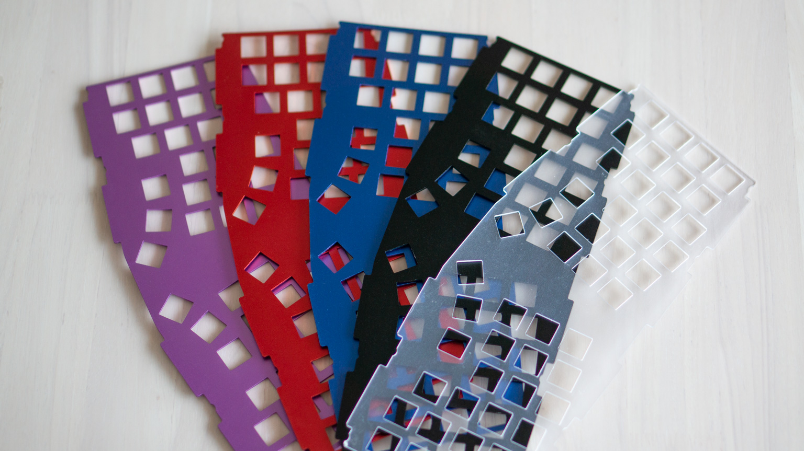

__Foam__

__Gasket foam__

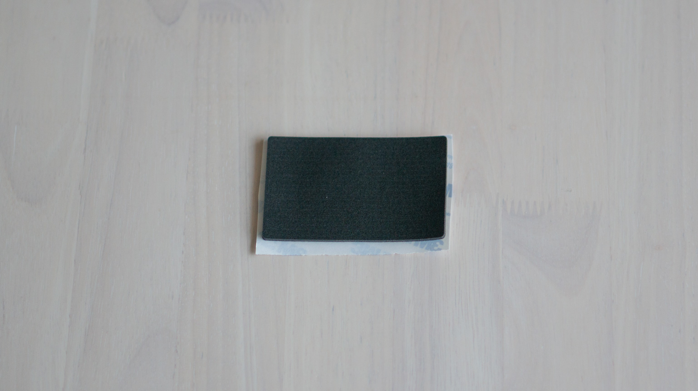

__Screws etc.__

## The clearance between the E-White case and each part

For E-White, some changes were made to the coating process at the GB manufacturing stage to improve quality.
As a result, the surface texture and the white color have been greatly improved.

However, this has resulted in a thicker coating surface than before, which has caused a lack of clearance for some parts.
Specifically, interference may occur between the top body and bottom body, and between the top body and switch plate, depending on the combination of the machining accuracy of each part.

If you are concerned about interference, or if an assembly is difficult, please refer to [the following solutions](#how-to-fix-the-clearance-between-the-e-white-case-and-each-part).
Please check and deal with them before assembly.
Additionally, some of them have been handled for us before shipment.

## Check PCB operation

Before you start assembling, please make sure that the PCB is working properly.

We recommend you to use [VIA](https://caniusevia.com/) or [Remap](https://remap-keys.app/) to check the operation, since VIA-compatible firmware has already been written.

__Verification with VIA's Test Matrix__

__Verify by Test Matrix by Remap__

## Install the gasket foam.

Install the gasket foam on the bottom body and the top body.
You can also install it on the switch plate instead of the case.

When removing the gasket foam, be careful not to tear the foam.
Also, there is adhesive tape on one side of the gasket foam. Depending on how you remove it, the adhesive side may remain on the filme side, so it is recommended to carefully remove it with tweezers.

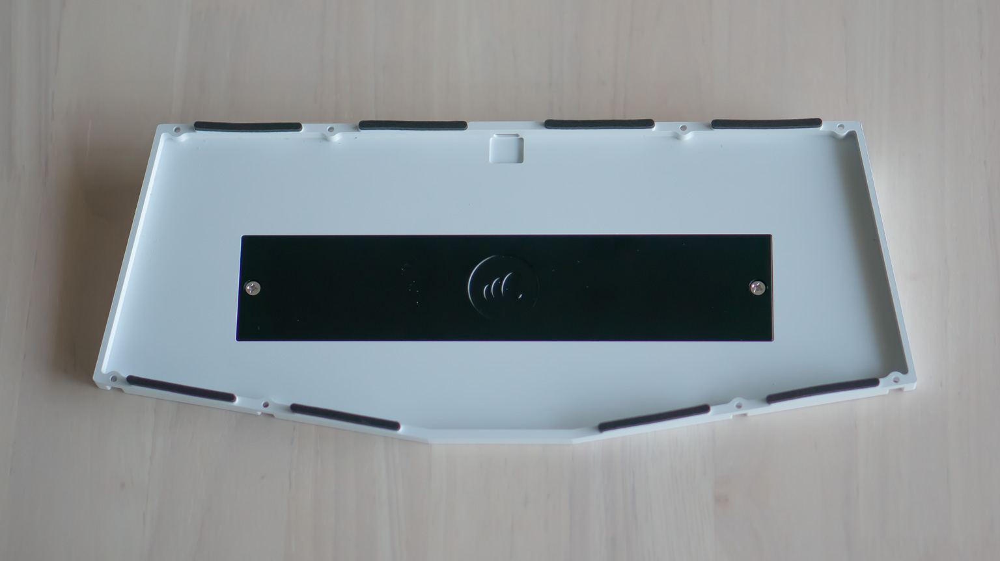

## Installing the switch

For the polycarbonate plate, there is a protective film on both sides, so carefully peel it off.

The polycarbonate plate has a glossy side and a semi-glossy side. The two sides of the plate are the same, so you can use whichever side you prefer.

Insert the switch foam between the PCB and the switch plate, and then attach the switch.

When attaching the switch, press it straight down from the top.
Place the PCB on a flat surface as shown in the photo, and push it in from directly above for easier insertion.

If you are using a solderable board, you can also solder it here.

## Case assembly

The weights on the bottom body are initially attached with silver screws.
You can change them to black screws if you like.

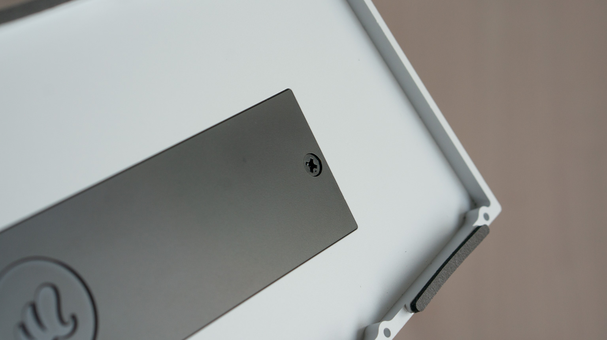

Put the bottom foam on the bottom of the bottom body, and put the PCB on top of it.

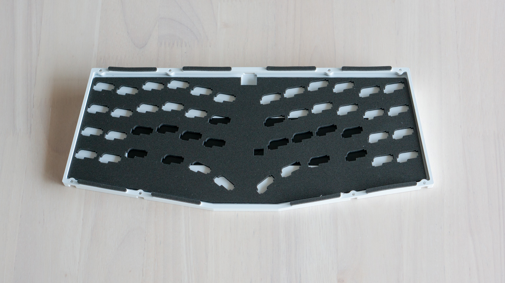

Install the top body straight from the top and while holding the top body by hand to prevent it from coming off, attach the screws from the back.

Attach cushion rubbers.

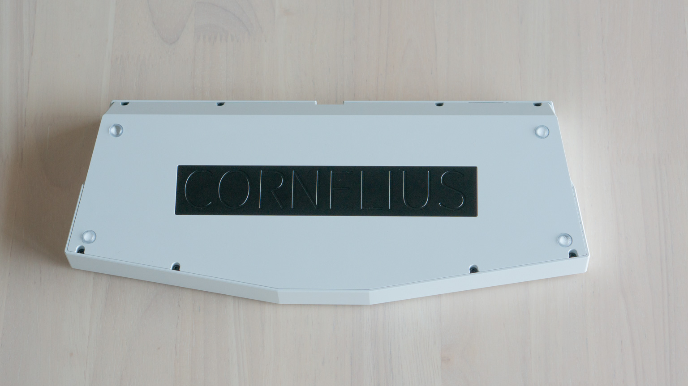

Finally, attach the key cap to complete the process.

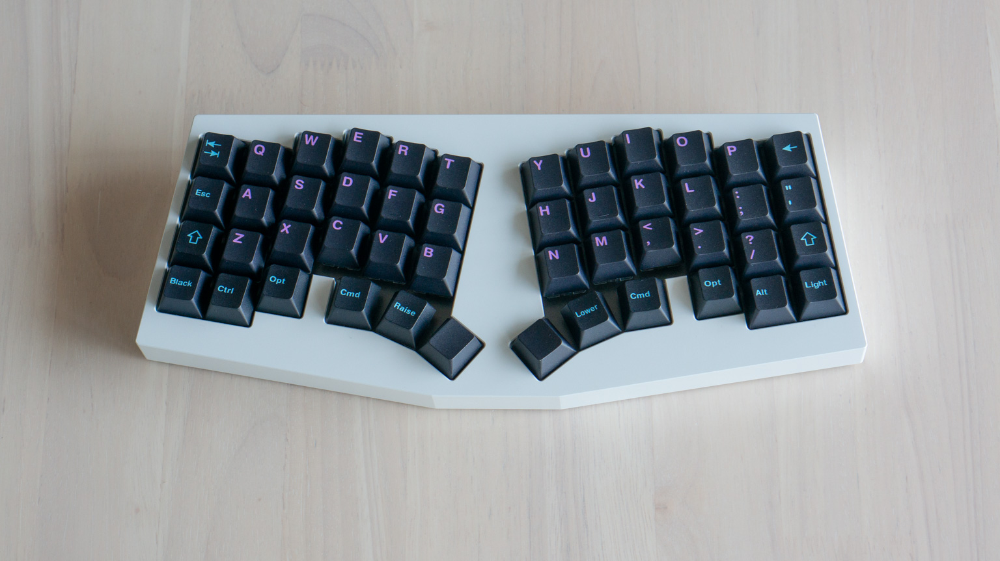

## how to fix the clearance between the E-White case and each part

The following is a step-by-step explanation of how to fix with interference between the top body and bottom body, and between the top body and plate.
Please note that it is necessary to remove about 0.1mm-0.2mm with a sandpaper. In the example shown here, we used a JIS standard #240. If you use a sandpaper with too rough a grit, it may damage the main body greatly, so it is safer to use a medium to fine grit file of #240-#400.

The number of the sandpaper varies depending on the standard. The JIS standard #240-#400 is roughly the same as the following for other standards.
- The United States CAMI: 240-320
- The European FEPA: P220-P400

The degree of shaving varies depending on the individual unit, so please check each time while working to avoid over-shaving.
I apologize for any inconvenience this may cause.

### When the top body and bottom body interfere with each other

If you feel a little resistance when opening and closing the top and bottom bodies, there is no problem.
However, if you feel it is too tight, first lightly scrape the following area on the bottom body.
It depends on the individual, but please refer to the following pictures.

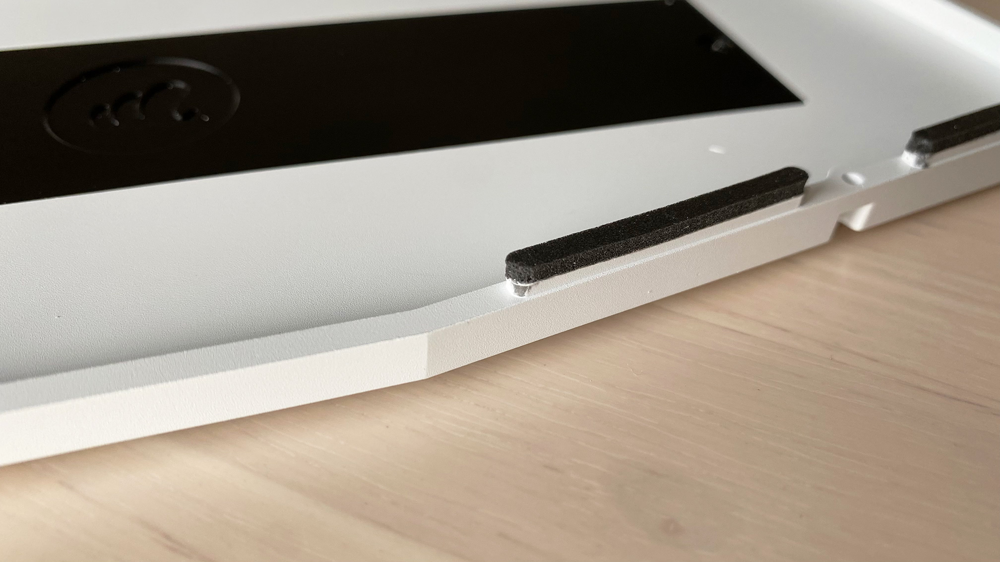

If the bottom body does not solve the problem, lightly scrape the following areas on the top body.
However, it is not recommended to shave this area as it is difficult to do so.

### When the top body and plate interfere with each other

First, please check how much interference there is.
Due to the nature of the gasket mount, if it interferes to the extent that you feel resistance, it will affect the feel.

If you feel resistance, first lightly scrape the following places on the plate.
It depends on the individual, but please refer to the following pictures.

If the problem is not solved by the plate side, lightly scrape the following areas on the top body.
However, it is not recommended to shave this area as it is difficult to do so.

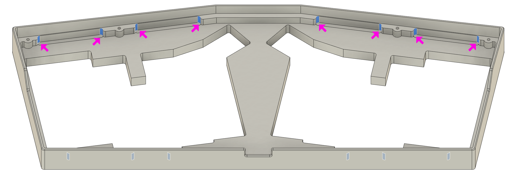

