# ビルドガイド

## パッケージ内容の確認
箱を開けたらまずは内容物が全て入っているか確認してください。

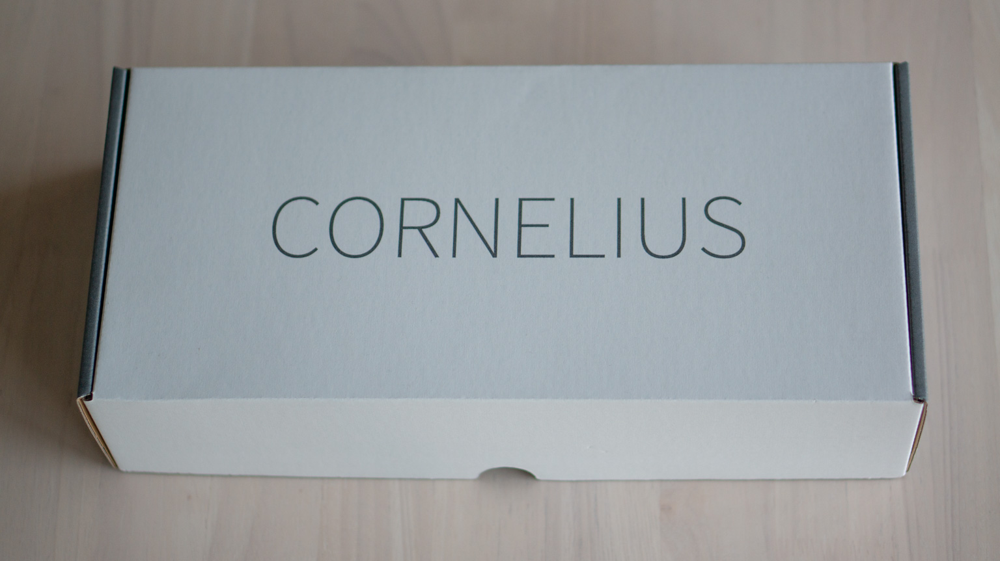

__キーボードケース本体__

予め予備のネジで上下のボディがネジ止めされています。
ネジを外して中をご確認してください。

ケースの内部など、組み立てたときに表から見えない部分については多少の傷や塗装が十分にされていない場合があります。
これは多くの場合、製造工程の都合で防ぐことが困難なものですので、ご理解いただけると助かります。
またE-Whiteケースと各パーツのクリアランスと対処方法については下記をご参照ください。

__PCB__

__スイッチプレート__

ご自身の選んだものが入っていることをご確認してください。

__フォーム__

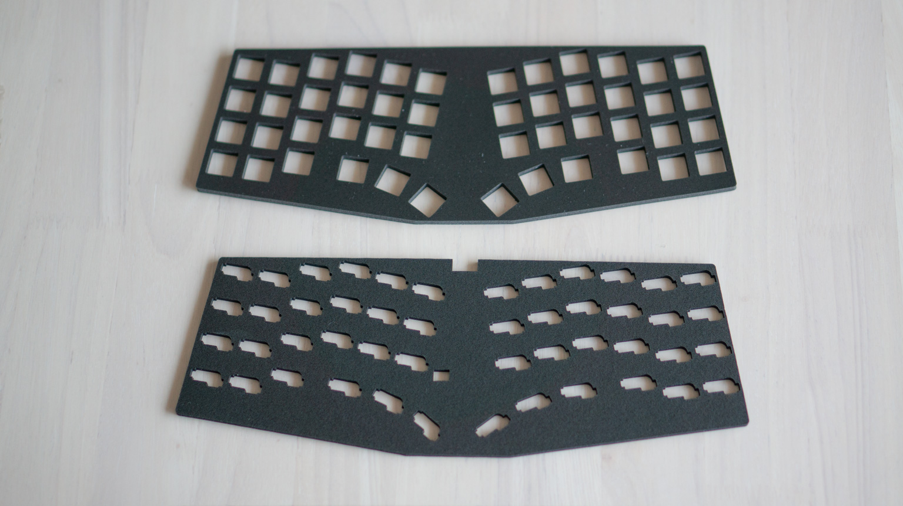

__ガスケットフォーム__

__ネジ類__

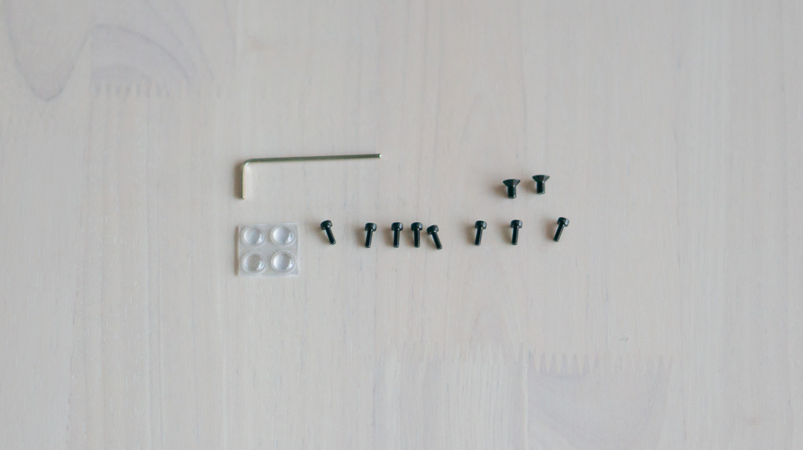

## E-Whiteケースと各パーツのクリアランスについて

E-Whiteについて、GBの製造段階で品質向上のためコーティング工程に一部変更がありました。
これにより表面の質感や白の色味が大幅に改善されました。

しかしこれによって従来よりも塗装面が厚くなり一部パーツのクリアランス不足が発生しております。
具体的には、トップボディとボトムボディ、トップボディとスイッチプレートにおいて、各パーツの削り出し精度の組み合わせによって干渉を起こす場合があります。
ケースの内側であるという点、キーボードの性能上の問題はないという点でこのままの出荷となったことをご理解いただけますと幸いです。

干渉について気になる方、組み立てが困難な場合は[下記対処方法](#E-Whiteケースと各パーツのクリアランスに関する対処方法)をご参照ください。
また組立前にご確認/対処して頂ければと思います。
なお出荷の段階でこちらで対処したものも含まれています。

## PCBの動作確認

組み立てを始める前にPCBが正常に動作することをご確認してください。

既にVIA対応のファームウェアが書き込まれた状態なので、動作確認には [VIA](https://caniusevia.com/) もしくは [Remap](https://remap-keys.app/) を利用することをおすすめします。

__VIAのTest Matrixによる確認__

__RemapのTest Matrixによる確認__

## ガスケットフォームの取り付け

ボトムボディおよびトップボディの該当位置にそれぞれガスケットフォームを取り付けます。
なおケースではなくスイッチプレートに取り付けても問題ありません。

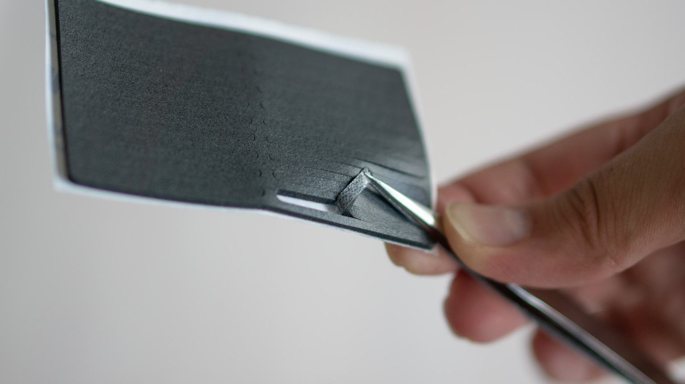

なおガスケットフォームを取り外すときはフォームを破らないようにお気を付けください。
またガスケットフォームの片面には粘着テープが付いています。剥がし方によって粘着面がフィルム側に残ってしまう場合があるのピンセットで丁寧に取ることをおすすめします。

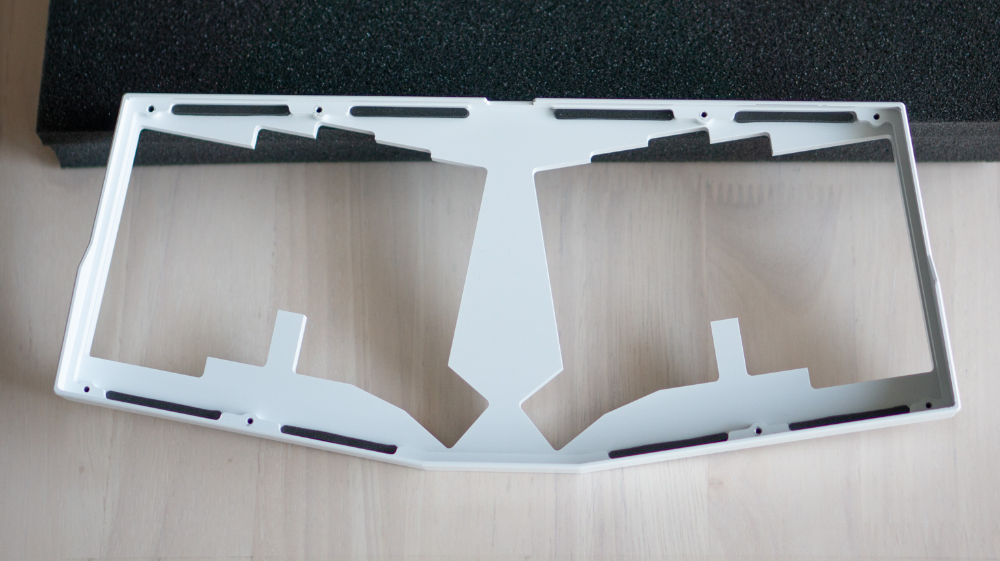

## スイッチの取り付け

ポリカーボネートプレートの場合は、両面に保護フィルムが付いているので丁寧に剥がします。

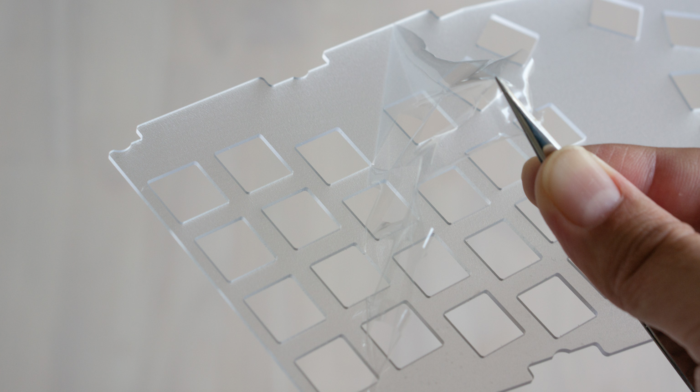

ポリカーボネートプレートは光沢面と半光沢面があります。プレートは裏表同じなのでお好きな方を表にしてお使いください。

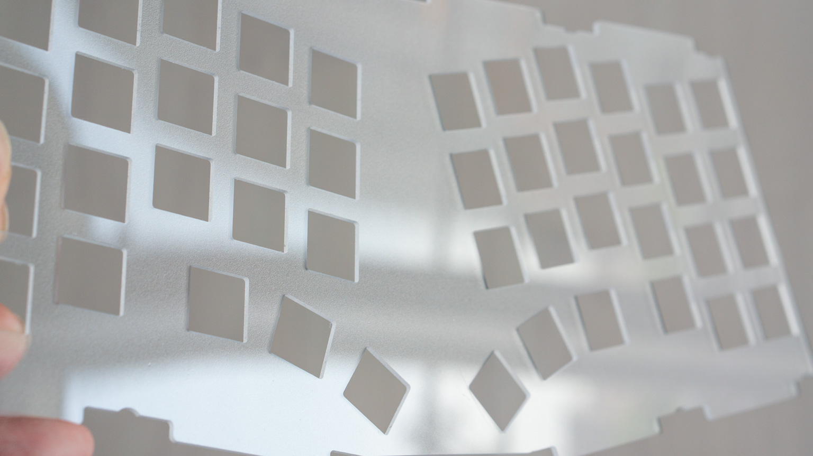

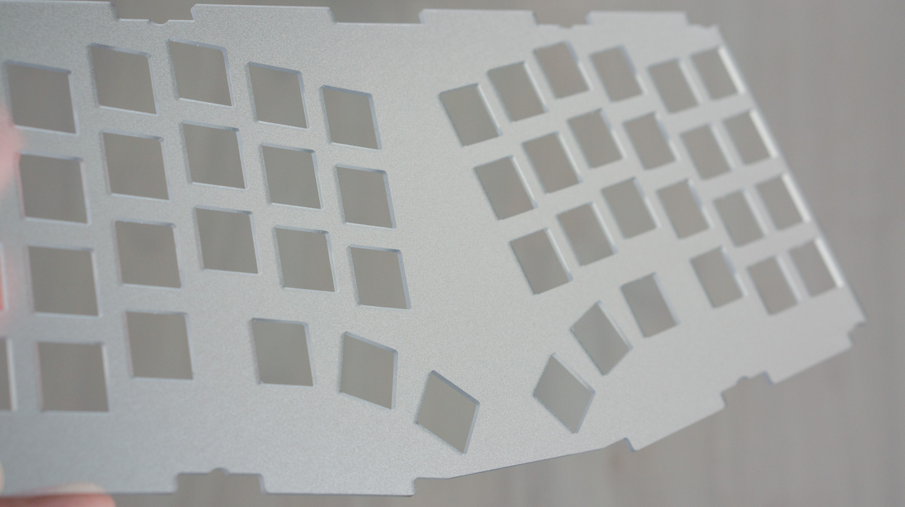

PCBとスイッチプレートの間にスイッチ用のフォームを挟み込み、スイッチを付けていきます。

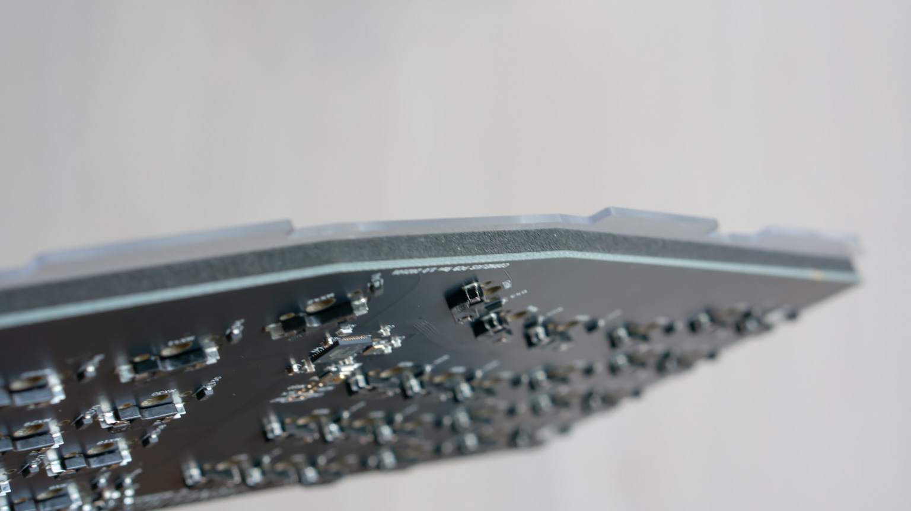

スイッチを取り付けるときはまっすぐに上から押し付けるようにして付けます。
写真のようにPCBを平らな場所に置き、真上から押し込むと入れやすいです。

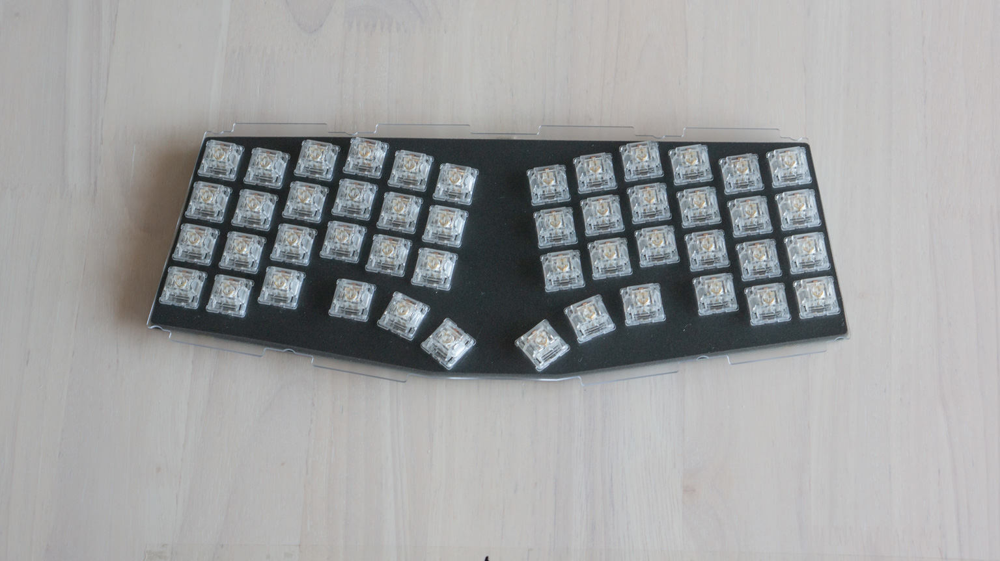

また、はんだ付け版の基板の場合はここではんだ付けも行います。

## ケースの組み立て

ボトムボディに付いているウェイトは、最初は銀色のネジで付けられています。
お好みに応じて黒色のネジに変更ができます。

ボトムボディの底にボトム用のフォームを敷き、その上からPCBを乗せます。

トップボディを上からまっすぐに取り付け、裏からネジを付けていきます。

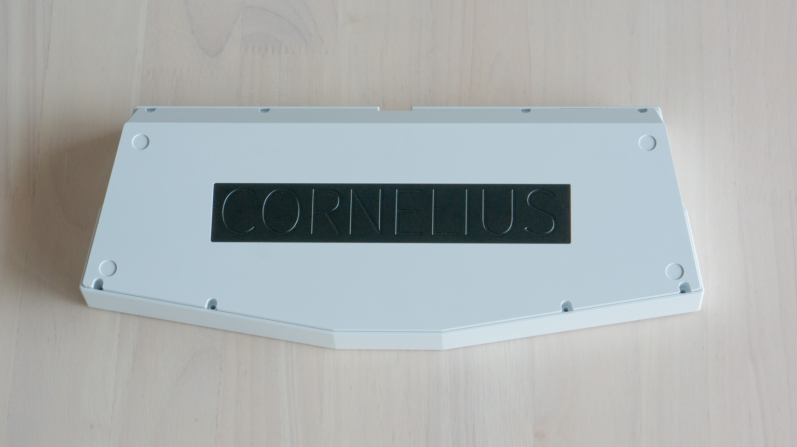

クッションゴムを付けます。

最後にキーキャップを取り付けて完成です。

## E-Whiteケースと各パーツのクリアランスに関する対処方法

トップボディとボトムボディが干渉する場合とトップボディとプレートが干渉する場合の対処方法をそれぞれ順を追って説明します。

なお指定箇所を紙ヤスリ等で0.1mm-0.2mm程削って頂く必要があります。なお掲載する対処の例ではJIS規格の#240の紙ヤスリを使用しました。
あまり目の荒いヤスリを使用すると本体を大きく傷つけてしまう恐れがあるので#240-#400番の中目から細目の紙ヤスリを使用すると安心です。

個体によって削る程度が異なりますので削り過ぎないよう都度確認しながら作業して頂ければと思います。
お手数おかけして申し訳ございません、よろしくお願いします。

### トップボディとボトムボディが干渉する場合

トップボディとボトムボディを開け閉めで少し抵抗がある程度であれば問題ありませんが、きつく感じる場合はまずはボトムボディの下記の場所を軽く削ってください。
個体差にもよりますが、下記写真をご参考にしてください。

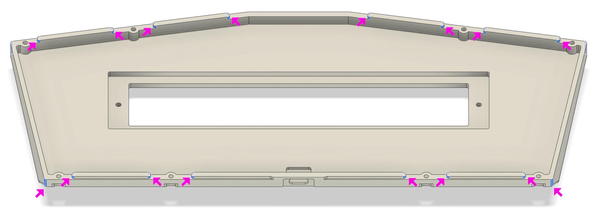

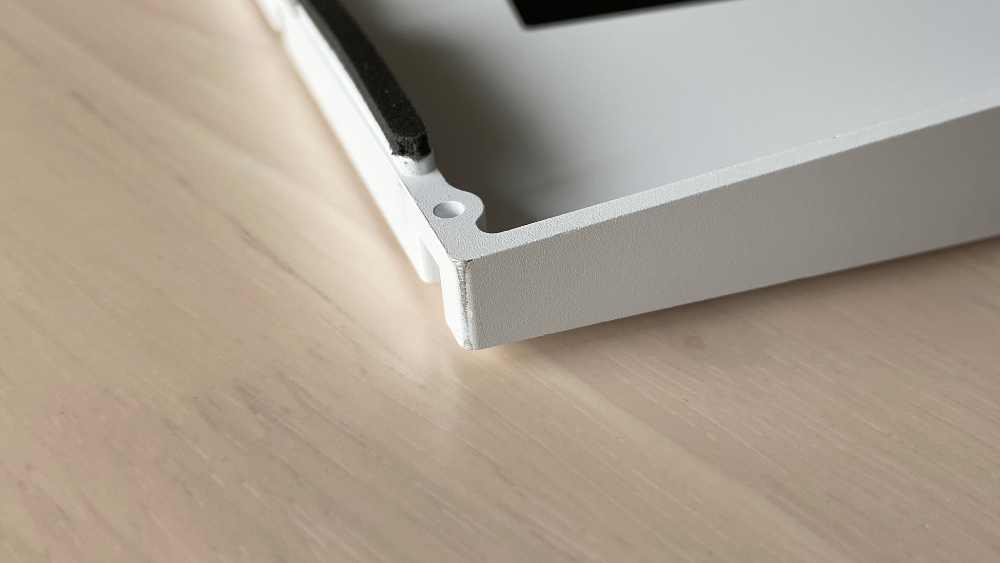

ボトムボディ側の対応で解決しない場合、トップボディの下記の場所を軽く削って下さい。
ただしこちらに関しては削るのが難しい箇所となりますので、こちらを削ることはあまりおすすめしません。

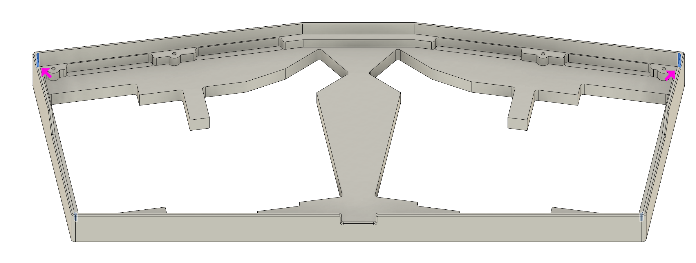

### トップボディプレートが干渉する場合

まずはどの程度干渉するかご確認してください。
ガスケットマウントという特性上、抵抗を感じる程度干渉している場合打鍵感に影響します。

抵抗を感じる場合はまずはプレートの下記の場所を軽く削って下さい。
個体差にもよりますが、下記写真をご参考にしてください。

プレート側の対応で解決しない場合、トップボディの下記の場所を軽く削って下さい。
ただしこちらに関しては削るのが難しい箇所となりますので、こちらを削ることはあまりおすすめしません。

